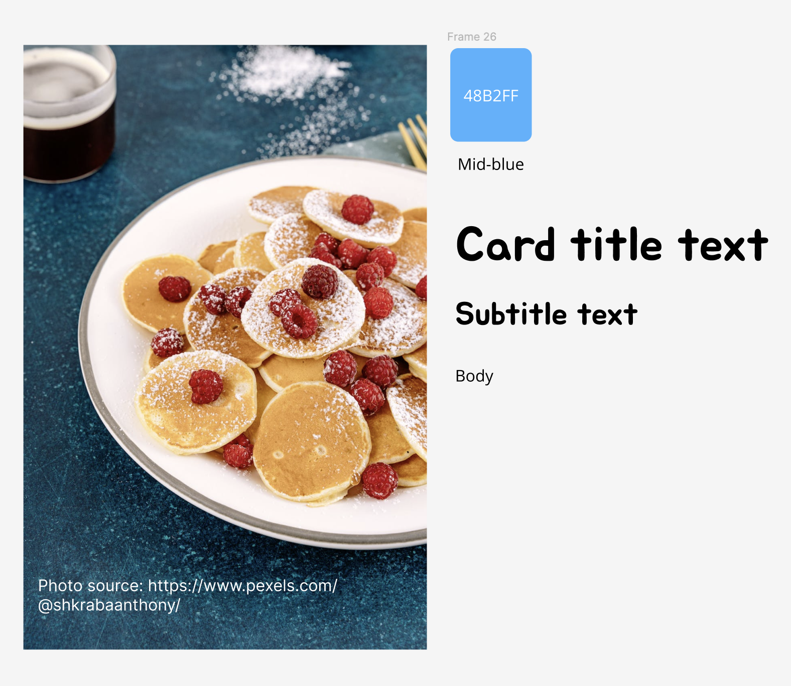
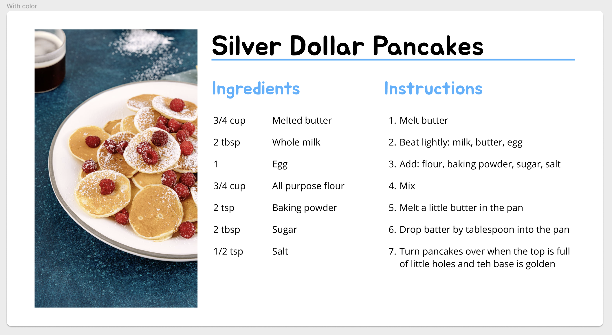
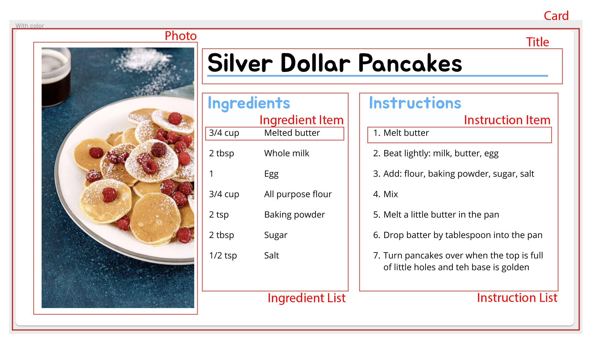

# HTML to JSX and Componentization

Today we are going in inspect a simple design for a recipe card made in Figma. Break the design into atomic components and styles and then load the content from data. Lets get started!

First, lets view and discuss a few designs/layouts:
[Simple Recipe Card](https://www.figma.com/file/oPToKD0BEwCUQFt3OjCDw6/RecipeCardStarter?type=design&node-id=2%3A134&mode=dev)

Morgan, our designer was kind enough to call out our font and color variables for clarification. We will revisit these once we add our CSS.



Now lets take a look at a desktop layout for our recipe card. We could make this one giant component, and load all of the recipe info including the image via some JSON, but that wouldnt make any of our work very reusable would it?



We can quickly mark this up and visualize our atomic components and thier parent/child relationships:



Our final goal is for our components to break down into something like this in our project:

```
<Card>
  <RecipeImg />
  <RecipeTitle />
  <IngredientList>
    <IngredientItem/>
    <IngredientItem/>
    <IngredientItem/>
  </IngredientList>
  <InstructionList>
    <InstructionItem/>
    <InstructionItem/>
    <InstructionItem/>
  </InstructionList>
</Card>
```

We might need to pepper in a few extra jsx elements for layout purposes once we start styling, but for now this is basically how our components will nest.

## In Class Exercise 1: HTML to JSX

Create a new create-react-project for todays exercise.

```bash
npx create-react-app recipe-card
cd recipe-card
npm start
```

Be sure to clear out all of the starter files expect our index.html and index.js!

Now we are going to split our App component out from our index.js. We do this by:

- Create an `App.js` file
- Make an App component that returns JSX
- Export that component
- Import our App component to index.js
- Use our `<App />` component in index.js

index.js:

```jsx
import React from 'react'
import ReactDOM from 'react-dom/client'
import App from './App'

const root = ReactDOM.createRoot(document.getElementById('root'))
root.render(
  <React.StrictMode>
    <App />
  </React.StrictMode>
)
```

App.js

```jsx
import React from 'react'

function App() {
  return <div>Hello App!</div>
}

export default App
```

After we take a moment together to create a RecipeCard component and import and use it in App.js (We are going to keep our top level app component as clear as possible for now), take a momment to port your HTML recipe HW into your RecipeCard component code.

- Make a folder called `/assets` for you image
- make a folder titled `RecipeCard`
- Create an ` index.js`` file inside  `RecipeCard/` and create your component there.
- to import an image from assets:

```jsx
import RECIPE_IMG from '../assets/pancake.png'
```

- to use that image:

```jsx

```

## In Class Exercise 2: Rendering content from data

Now that we have a component rendering our hardcoded recipe, lets take a second to create a recipe object so that we can render our recipe from data instead of hardcoding it in our JSX. Lets name that file `recipe-data.js` and save it inside of our `RecipeCard/` directory.

When you are finished you should have something resembling:

```js
export const RECIPE = {
  title: 'Buttermilk Pancakes',
  imgSrc: require('../assets/pancake.png'),
  description:
    'Some sort of lovely description about the best buttermilk pancakes in the world.',
  ingredients: [
    '3/4 cup Melted butter',
    '2 tbsp Whole milk',
    '1 Egg',
    '3/4 cup All purpose flour',
    '2 tsp Baking powder',
    '2 tbsp Sugar',
    '1/2 tsp Salt',
  ],
  instructions: [
    'Melt butter',
    'Beat lightly: milk, butter, egg',
    'Add: flour, baking powder, sugar, salt',
    'Mix',
    'Melt a little butter in the pan',
    'Drop batter by tablespoon into the pan',
    'Turn pancakes over when the top is full of little holes and teh base is golden',
  ],
}
```

Now that we have the data let's import and use it in our `RecipeCard` component.

```jsx
import {RECIPE} from './recipe-data'
```

example usage:

```jsx
      
     <h1>{RECIPE.title}</h1>
```

_note: you'll have to map through the arrays of ingredients and instructions in order for them to render as individual `<li>`_

Woo Hoo! We are now rendering all of our recipe info from a data file. In the future we can trade recipes with fellow students as long as we keep the exact same data format.
