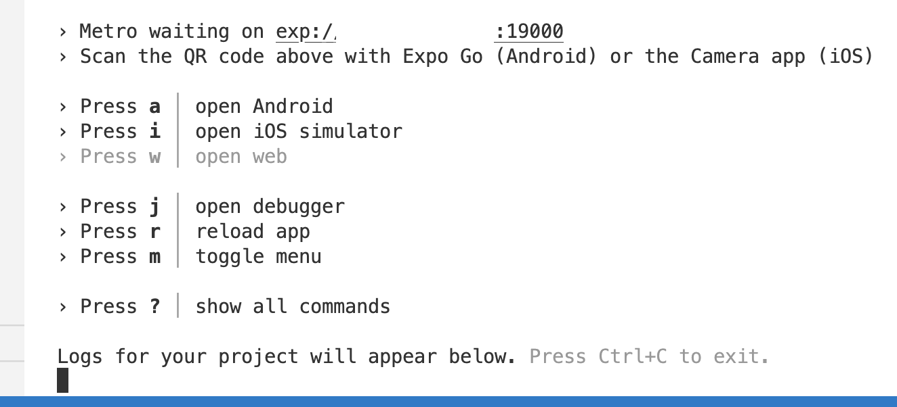

# Using iOS and Android Simulators

When we put our first bit of code on our phones this week, it was a pretty quick setup. Some of you however, have already experienced reload issues after saving code with an error. Direct to phone is quick and easy, but sometimes the latest code might have issues updating on your device.

Our other option, is to set up phone emulators on our computers. The setup takes a little longer, and is operating system specific, but ultimately a better developer experience. Just remember that these emulators use a lot of RAM, and as a result they may slow your computer down a but while running. This document contains setup instructions for both Windows and Apple computers, for both Andriod and iPhone device emulators. For this class, a single emulator will suffice. But remember when building a mobile application, you should always test on both Android and iOS.

Here are the official Expo docs with some troubleshooting tips are available here:

https://docs.expo.dev/workflow/ios-simulator

https://docs.expo.dev/workflow/android-studio-emulator

## macOS

### XCode iOS Simulator

1. Download the full version of Xcode from the App Store. This is a huge file around 7GB+, so, it can take a LONG time to download and install. It might seem like it it is stuck and not installing, but it is probably not.
2. Launch XCode and agree to its terms. It will start installing more tools and software
3. Eventually, you will get a "Welcome to XCode" screen
4. In the top menu bar, click "XCode", then "Preferences" and then "Locations".
5. Make sure that the "Command Line Tools" are installed and selected.

6. 
7. In the XCode menu, select "Open Developer Tool" and then "Simulator".
8. You can change the default device by right-clicking the Simulator icon in the App menu bar and choosing your preferred ios version and ios device.
9. After your device has been chosen, go to your terminal and in your React Native project directory, run npx expo start
10. You should see a scannable QR code along with a menu. Press the "i" key to open your iOS simulator:

11. 
12. This will attempt to launch the Expo application in a simulated device and run your bundled code.
13. Your iPhone device simulator should prompt you with an “Open In Expo” button. Click Open.
14. Eventually, the device simulator should load the “Hi There!” screen from your application.

### Android Studio Simulator

1. Install Android Studio: https://developer.android.com/studio
2. After downloading, run the installer.
3. Open Android Studio from your Applications. A dialog box should pop up. Do not Import Settings, Just Click "Ok"
4. Click “Next" to go thru the Wizard
5. Click “Next” to do a Standard install
6. Choose a theme for your editor and click “Next”
7. Click "Next" on the Verify Settings screen.
8. Accept the ToS and click “Finish”
9. Android Studio should open for the first time and show you a Welcome screen. Click "More Actions" and then "Virtual Device Manager".
10. Click the "Create a Device button"
11. Select a Device from the list and click “Next”
12. If the System Image for the most recent SDK is not installed, you will need to click the "Download" link next to the SDK version.
13. After the image has been downloaded, click “Next”
14. Preview the settings and then click “Finish”
15. You should see the newly created device in the “Your Virtual Device” screen.
16. Click the Play ▶️ button all the way to the right in the "Actions" column.
17. This will open an Android simulator on your machine. If everything is working well, it should power up and load a generic screen with a few apps.
18. Go to your terminal and in your React Native project directory, run npx expo start
19. You should see a scannable QR code along with a menu. Press the "a" key to open your Andriod emulator:
20. 
21. This will attempt to launch the Expo application and run your bundled code. Eventually, the device emulator should load the “Hi There!” screen from your application.

## Windows

### iOS Simulator - There isn't one.

You cannot run iOS simulators on Windows. (Ah operating system wars...) But do not despair! You can still run expo and scan the QR code and test on a phsyical iOS device.

### Android Studio Simulator

Make sure Virtualization is enabled in your BIOS. Also, note, your processor must support HAXM. If it does not (which is common with many AMD or non-Intel machines) you will likely not be able to run the simulators. HAXM will also conflict with the Hyper-V Manager if it is enabled.

1. Install Android Studio: https://developer.android.com/studio
2. After Downloading run the installer.
3. Click “Next" to go through the installer wizard.
4. Click “Next” on Choose Components screen
5. Click “Next” on the Configuration Settings screen
6. Click “Install”
7. After completion click “Next”
8. Click “Finish”
9. In the next dialog box that pops up, do not Import settings, Just Click "Ok"
10. Click “Next" to go thru the Wizard
11. Select if you wish to send statistics to Google and click "Next".
12. Click “Next” to do a Standard install
13. Choose a theme for your editor and click “Next”
14. Verify your settings and click "Next"
15. Accept the ToS and click "Finish"
16. Android Studio should open for the first time and show you a Welcome screen. Click "More Actions" and then "Virtual Device Manager".
17. Click the "Create a Device button"
18. Select a Device from the list and click “Next”
19. If the System Image for the most recent SDK is not installed, you will need to click the "Download" link next to the SDK version.
20. After the image has been downloaded, click “Next”
21. Preview the settings and then click “Finish”
22. You should see the newly created device in the “Your Virtual Device” screen.
23. Click the Play ▶️ button all the way to the right in the "Actions" column.
24. This will open an Android simulator on your machine. If everything is working well, it should power up and load a generic screen with a few apps.
25. Go to your terminal and in your React Native project directory, run npx expo start
26. You should see a scannable QR code along with a menu. Press the "a" key to open your Andriod emulator:
27. 
28. This will attempt to launch the Expo application and run your bundled code. Eventually, the device emulator should load the “Hi There!” screen from your application.
